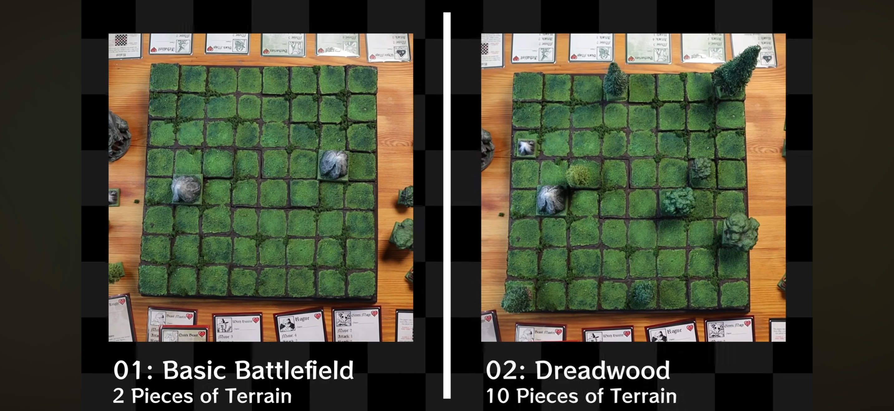

import YouTubeEmbed from '../../components/YouTubeEmbed.astro';

_nubmark put out a new video last night and a pile of new files with it. If you play [Motley Crews](/games/motley-crews/), or you've been meaning to, this is the biggest day the game has had in a while.

<YouTubeEmbed videoId="PK7oVFrhXhM" title="Taking my Tabletop Game to the Next Level" />

## Denizens of Dreadwood

A new party has joined that game: [Denizens of Dreadwood](https://underscore-nubmark.itch.io/motley-crews-miniatures-set-denizens-of-deadwood), eight printable miniatures for $5. Five characters and three beasts: Baron Valdrak the Black Knight, Hannibal the Beastmaster, Lars the Witch Hunter, Robbie the Rogue, Gravröse the Green Mage, then a Strong Beast, a Quick Beast and a Tough Beast to go with the Beastmaster.

They come as unsupported STLs meant for resin, sized for 25mm square bases, and the itch.io includes the figure cards for free so you can use your own minis if you want, but these new guys are awesome. I have them on my printer as I type this.

## Motley Crews Advanced

The Dreadwood release brings a new version of the game. Motley Crews Advanced changes the terrain layout to use 10 pieces instead of 2, and more importantly it opens up the rosters.

You’re no longer locked to a crew as it comes in the box. You can mix and match across the whole pool of figures now and pick any five classes you want, with one restriction: no more than one of each class per team. So no stacking three mages and calling it a strategy.

I love how this style of list building keeps the rules very simple but now opens up a world of new combinations. New teams are apparently in development as well.

## Free Cows and Terrain

There’s now a Motley Cows set, pay what you want, described in full as “Have a cow, man!” That’s the entire pitch and honestly it’s enough. I love these little cuties.

There’s also a pay what you want terrain set of printable STLs. Between the terrain, the cows, and the rules being free to begin with, you can put a whole table together and all three official teams for only $15. It’s all on [_nubmark’s itch page](https://underscore-nubmark.itch.io/).

## Physical Minis, One Week Only

Valentin at Maison Nébuleuse is running a [pre-order week](https://www.maisonnebuleuse.com/product/nubmark-motley-crews-pre-order-week) from 24 to 31 August for physical resin versions, sculpted by _nubmark and printed by Trashfire Studio in France. Three adventurer crews at fifteen characters total, two knight singles, and terrain including a cow, a tree and a rock. Dark grey ABS-like resin, four to six weeks out.

Volume discounts kick in at five, ten and fifteen miniatures. A euro per mini goes to the Blue Marine Foundation.

This is the game that got me back into the hobby full force, so take my enthusiasm with the appropriate amount of salt. But free rules, free terrain, free cows and a five dollar crew is about as low as a barrier gets, and I just absolutely love the sculpting style.
